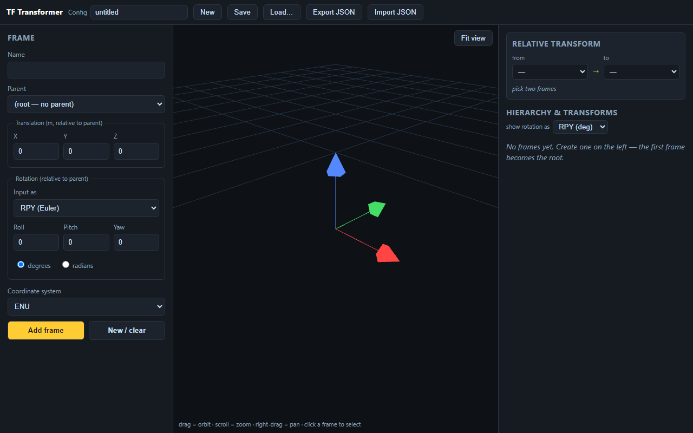
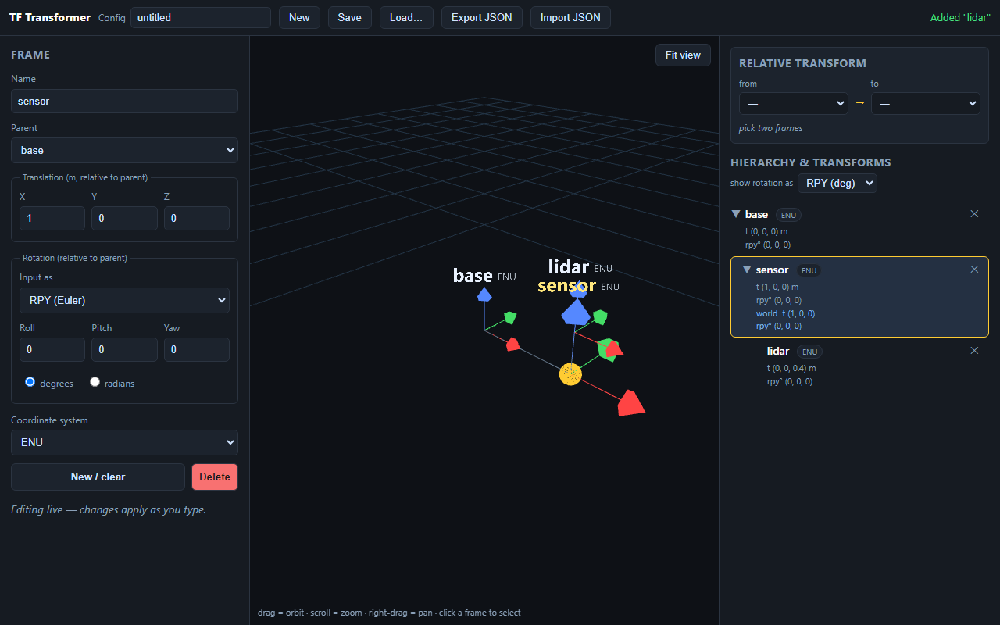

# TF Transformer

Browser-based configurator and 3D visualizer for ROS2-style TF coordinate
frame trees. Build a hierarchy of frames (offset + rotation relative to a
parent, per-frame coordinate convention), see them in 3D, and save/load the
whole session as JSON. No ROS2 installation required — runs on Windows without
WSL.

- **Left panel:** create / edit a frame (name, parent, XYZ offset, rotation,
  coordinate system). A selected frame **updates live** as you type — no
  apply button. Rotation can be entered as **RPY** (deg or rad) or as a
  **quaternion**.
- **Center:** 3D view of all frames with their hierarchy (axis triads, name
  labels, parent→child links, orbit/zoom/pan, click to select). **Fit view**
  frames everything; **double-click a frame** focuses the camera on it. The
  ENU reference triad is shown only while the scene is empty.
- **Right panel:** a **Relative transform** query (pick *from* / *to*, see the
  pose of one frame in another's frame plus distance — like `tf2_echo`), and
  the hierarchy tree with each frame's local pose (and the resolved world pose
  for the selected frame). Rotation display is switchable: **RPY° / RPY rad /
  quaternion / 3×3 matrix**.
- **Top bar:** config name, New / Save / Load (server) / Export / Import JSON.

Legacy configs (old `{roll,pitch,yaw}` + `angle_unit` schema) are
**auto-migrated** to the canonical quaternion on Import and on Load (the
backend up-converts on read), with a notice — no data loss.
- **Top bar:** config name, New / Save / Load (server) / Export / Import JSON.

## Screenshots

Empty workspace — ENU reference triad and the three-pane layout (frame
inspector · 3D view · hierarchy and queries):



A small frame tree `base → sensor → lidar` with `sensor` selected — live
editing on the left, parent→child links in the 3D view, world pose and the
relative-transform query on the right:



## Requirements

- Python 3.10+
- A modern browser (ES modules + import maps; Three.js is vendored, no Node/npm)

## Run

```bash
pip install -r backend/requirements.txt
python -m uvicorn backend.app:app --host 127.0.0.1 --port 8000
```

Open <http://127.0.0.1:8000/>. Saved configs are written as JSON to the
`configs/` directory (override with the `TF_CONFIG_DIR` env var).

## Deploy on a server

```bash
pip install -r backend/requirements.txt
TF_CONFIG_DIR=/var/lib/tf-transformer/configs \
  python -m uvicorn backend.app:app --host 0.0.0.0 --port 8000
```

FastAPI serves both the API and the static frontend, so a single process is
enough. Put it behind nginx/Caddy for TLS if exposing publicly.

Production notes:

- Run **without** `--reload`. One worker is fine (state is the filesystem);
  if you scale workers, point `TF_CONFIG_DIR` at shared storage.
- `GET /healthz` → `{"status":"ok","version":...}` for load-balancer / probe
  health checks.
- `configs/` (or `TF_CONFIG_DIR`) is the only writable data directory — back
  it up / mount it as a volume.
- Dependencies are pinned in `backend/requirements.txt` for reproducible
  installs.

## Data model

A config is one JSON document: `{ name, version, frames[], metadata }`. Each
frame has `id`, `name` (ROS `frame_id`, no spaces), `parent_id` (`null` for the
single root), `translation {x,y,z}` (m, relative to parent), `rotation
{x,y,z,w}` (a **canonical quaternion**, relative to parent), and `convention`
(`ENU`|`NED`|`FRD`|`FLU`). RPY and the 3×3 matrix are lossless UI conversions;
the stored truth is the quaternion. This same JSON is used by Save/Load and by
Export/Import.

## Conventions (REP-103)

Internal canonical basis is **ENU** (right-handed, Z up). `ENU`/`FLU` map to
identity; `NED`/`FRD` are the Z-down variants (proper rotations, det = +1):

- `NED`: `[[0,1,0],[1,0,0],[0,0,-1]]` (180° about (1,1,0)/√2)
- `FRD`: `[[1,0,0],[0,-1,0],[0,0,-1]]` (180° about X)

Rotation uses the tf2/REP-103 RPY convention `R = Rz(yaw)·Ry(pitch)·Rx(roll)`.
A frame's convention reorients its own triad **and propagates down the chain**
(a child is specified relative to its parent's drawn axes). An all-ENU/FLU
tree therefore behaves as plain TF.

## Tests

Backend (API persistence + validation status codes):

```bash
python -m pytest tests/test_api.py -q
```

Math core (RPY convention, the 4 coordinate systems, world chain, cycle
rejection) and 3D frame picking — open in a browser via a static server at
the project root:

```bash
python -m http.server 8765
# open http://127.0.0.1:8765/tests/test_transforms.html
# open http://127.0.0.1:8765/tests/test_pick.html
```

## Project layout

```
backend/    FastAPI app, Pydantic models, JSON file storage
frontend/   index.html, css, js (state, api, math, ui panels, 3D scene), vendored three
configs/    saved JSON configs (created on first save)
tests/      test_api.py (pytest) + test_transforms.html / test_pick.html (browser)
```
